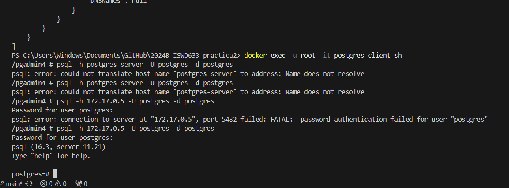
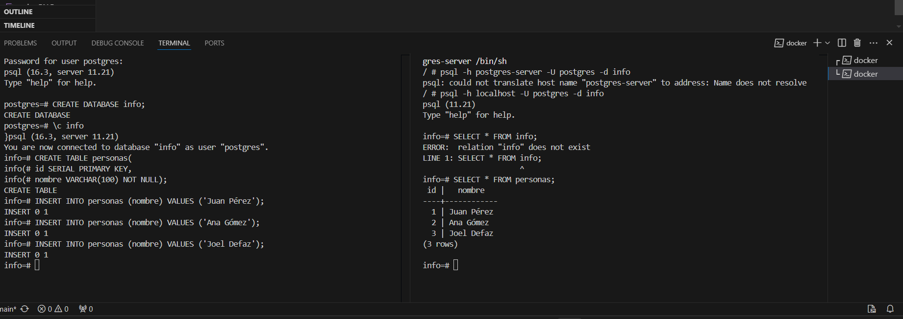

### Crear contenedor de Postgres sin que exponga los puertos. Usar la imagen: postgres:11.21-alpine3.17
```
docker run -d --name postgres-server -e POSTGRES_PASSWORD=1234 postgres:11.21-alpine3.17
```

### Crear un cliente de postgres. Usar la imagen: dpage/pgadmin4
```
docker run -d --name postgres-client -e PGADMIN_DEFAULT_EMAIL=joe.def2019@gmail.com -e PGADMIN_DEFAULT_PASSWORD=123 dpage/pgadmin4
```

# COMPLETAR

La figura presenta el esquema creado en donde los puertos son:
- a: Puerto del Host
- b: Puerto del Contenedor de Postgres Client mapeado con el puerto del Host (a)
- c: Puerto del Contenedor de Postgres Server


## Desde el cliente
### Acceder desde el cliente al servidor postgres creado.
# COMPLETAR CON UNA CAPTURA DEL LOGIN


### Crear la base de datos info, y dentro de esa base la tabla personas, con id (serial) y nombre (varchar), agregar un par de registros en la tabla, obligatorio incluir su nombre.

## Desde el servidor postgresl
### Acceder al servidor
### Conectarse a la base de datos info
```
docker exec -it -u root postgres-server /bin/sh

psql -h localhost -U postgres -d info
```
### Realizar un select *from personas

# AGREGAR UNA CAPTURA DE PANTALLA DEL RESULTADO

