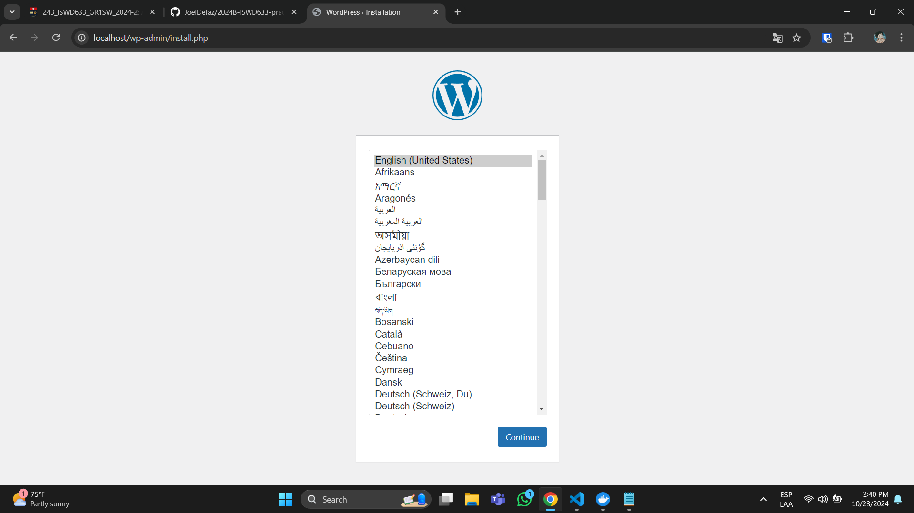
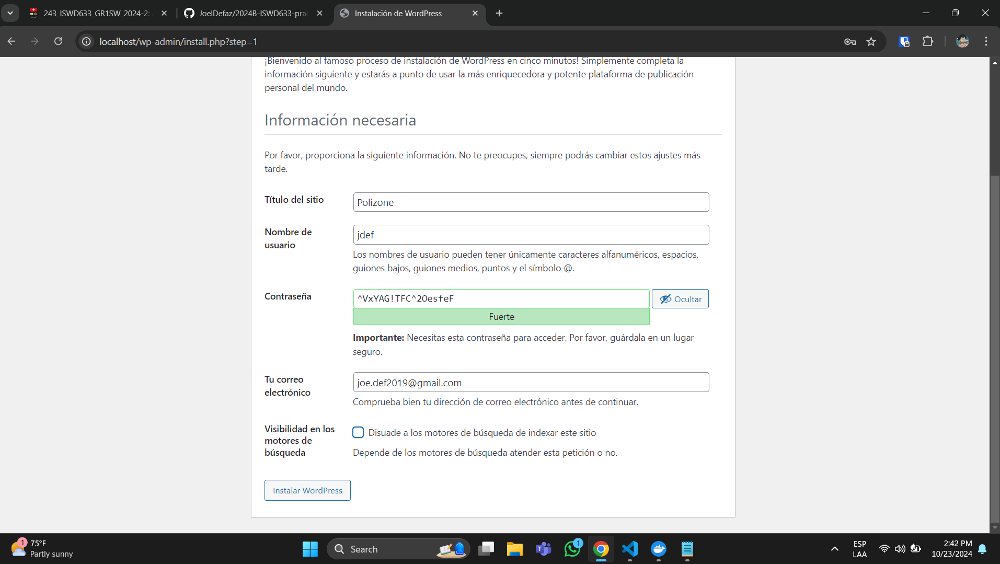
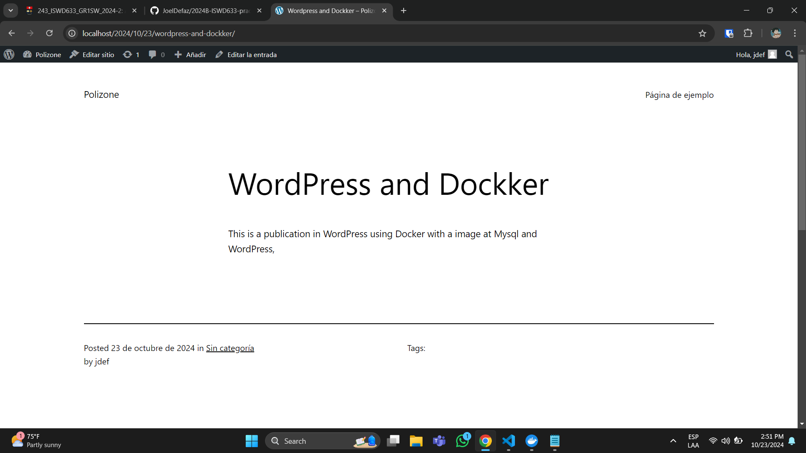
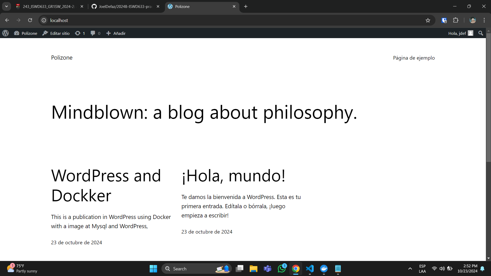

## Esquema para el ejercicio


### Crear la red
```
docker network create nwt-wp
```

### Crear el contenedor mysql a partir de la imagen mysql:8, configurar las variables de entorno necesarias
```
docker run -d --name mysql-server --env-file=./env/.env mysql:8
```

### Crear el contenedor wordpress a partir de la imagen: wordpress, configurar las variables de entorno necesarias
```
docker run -d --name wordpress-server -p80:80 --env-file=./env/word.env wordpress
```

De acuerdo con el trabajo realizado, en la/el esquema de ejercicio el puerto a es **El puerto del host**

Ingresar desde el navegador al wordpress y finalizar la configuración de instalación.
# COLOCAR UNA CAPTURA DE LA CONFIGURACIÓN



Desde el panel de admin: cambiar el tema y crear una nueva publicación.
Ingresar a: http://localhost:9300/ 
recordar que a es el puerto que usó para el mapeo con wordpress
# COLOCAR UNA CAPTURA DEL SITO EN DONDE SEA VISIBLE LA PUBLICACIÓN.



### Eliminar el contenedor wordpress
```
docker stop wordpress-server
docker rm wordpress-server
```

### Crear nuevamente el contenedor wordpress
Ingresar a: http://localhost:9300/ recordar que a es el puerto que usó para el mapeo con wordpress

### ¿Qué ha sucedido, qué puede observar?
Despues de realizar todo el proceso de crear el contenedor y añadirlo a la red, este se carga de nuevo como si no hubiera pasado nada. Esto es que se a eliminado el contenedor de Wordpress, pero no el de MySQL donde esta guardado toda la información